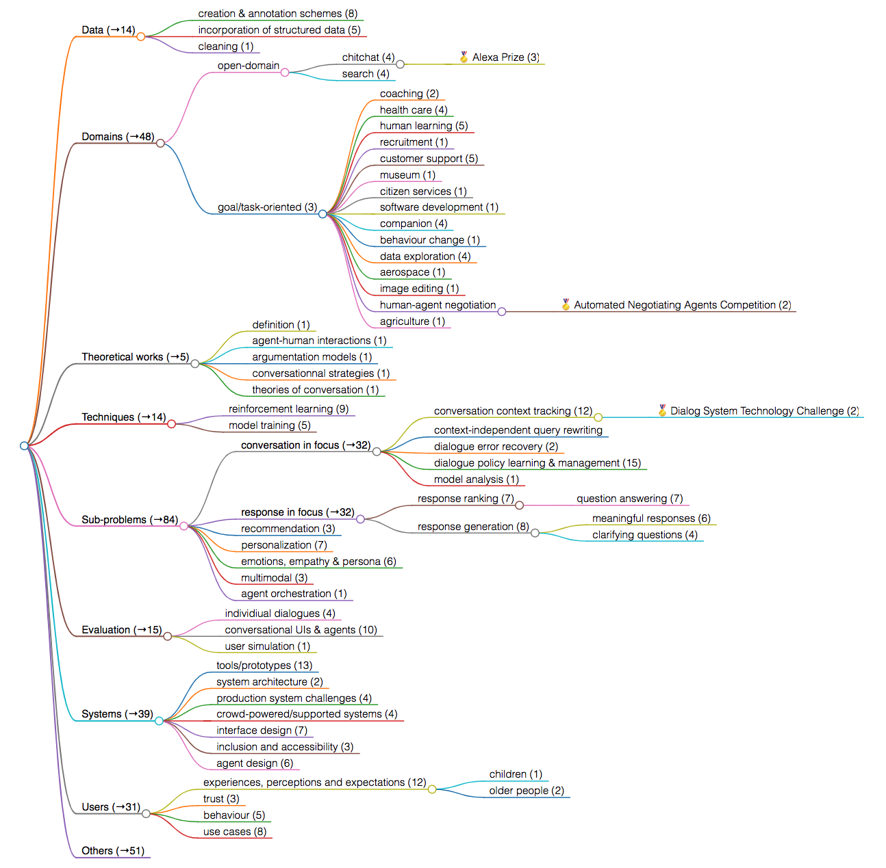

# Conversational IR

## Relevant workshops and conferences
- [Search-oriented conversational AI @ ICTIR 2017](https://scai.info/2017/)
- [Conversational Approaches to IR @ SIGIR 2017](https://sites.google.com/view/cair-ws/cair-2017)
- [Talking with Conversational Agents in Collaborative Action @ CSCW 2017](https://talkingwithagents.wordpress.com/)
- [1st Conversational AI: Today's Practice and Tomorrow's Potential @ NeurIPS 2017](http://alborz-geramifard.com/workshops/nips17-Conversational-AI/Main.html)
- [Search-oriented conversational AI @ EMNLP 2018](https://scai.info/2018/)
- [1st Workshop of Knowledge-aware and Conversational Recommender Systems @ RecSys 2018](https://kars-workshop.github.io/2018/)
- [Conversational Approaches to IR @ SIGIR 2018](https://sites.google.com/view/cair-ws/cair-2018)
- [2nd Conversational AI: Today's Practice and Tomorrow's Potential @ NeurIPS 2018](http://alborz-geramifard.com/workshops/nips18-Conversational-AI/Main.html)
- [NLP for Conversational AI @ ACL 2019](https://sites.google.com/view/nlp4convai/)
- [Search-Oriented Conversational AI @ WWW 2019](https://scai.info/www2019/)
- [Search-Oriented Conversational AI @ IJCAI 2019](https://scai.info/ijcai2019/)
- [Conversational Interaction Systems @ SIGIR 2019](https://sites.google.com/view/wcis/home)
- [Conversational Agents: Acting on the Wave of Research and Development @ CHI 2019](https://convagents.org/)
- [1st International Conference on Conversational User Interfaces 2019](https://dl.acm.org/doi/proceedings/10.1145/3342775)
- [Dagstuhl 2019 Seminar Conversational Search](https://www.dagstuhl.de/en/program/calendar/semhp/?semnr=19461)
- [3rd Conversational AI: Today's Practice and Tomorrow's Potential @ NeurIPS 2019](http://alborz-geramifard.com/workshops/neurips19-Conversational-AI/Main.html)
- [user2agent 2019: 1st Workshop on User-Aware Conversational Agents @ IUI 2019](https://www.research.ibm.com/haifa/Workshops/user2agent2019/)
- [Conversational Systems for E-Commerce Recommendations and Search @ WSDM 2020](https://wsdm-converse.github.io/)
- [3rd International Workshop on Conversational Approaches to Information Retrieval (CAIR) @ CHIIR 2020](https://sites.google.com/view/cair-ws/cair-2020)
- [Search-Oriented Conversational AI @ EMNLP 2020](https://scai.info/2020/cfp/)
- [user2agent 2020: 2nd Workshop on User-Aware Conversational Agents @ IUI 2020](https://www.research.ibm.com/haifa/Workshops/user2agent2020/)
- [2nd International Conference on Conversational User Interfaces 2020](https://cui2020.com/)
- [KDD Converse 2020: Workshop on Conversational Systems Towards Mainstream Adoption](https://conversekdd20.github.io/index.html)
- [CUI@CSCW2020: Collaborating through Conversational User Interfaces](http://speech-interaction.org/CSCW2020/index.html)
- [ACM Multimedia workshop Multimodal Conversational AI](https://sites.google.com/view/multimodal-conversational-ai/)
- [Workshop on Mixed-Initiative ConveRsatiOnal Systems (MICROS@ECIR2021)](https://micros2021.github.io/)
- [CUI@IUI2021 workshop: Theoretical and Methodological Challenges in Intelligent Conversational User Interface Interactions](http://speechinteraction.org/IUI2021/)
- [Conversational User Interfaces Conference (CUI 2021)](https://www.conversationaluserinterfaces.org/2021/)
- [Future Conversations 2021 workshop at CHIIR 2021](https://sites.google.com/view/cair-ws/future-conversations21)

## Research themes

This categorization was created in a bottom-up manner. I looked at the 300+ papers accepted by the workshops/conferences listed above (up to and including the MICROS 2021 workshop) and iteratively revised the categories. Each paper was included in only one category or sub-category. This is of course purely subjective; ask 10 different researchers to come up with categories and you get 10 different results ...

The bracketed numbers starting with → indicate the total number of papers in this branch of the tree; e.g. there are a total of 48 papers that fall into some node inside the `Domains` category. The bracketed numbers after a sub-category without → indicate the number assigned to this particular node by me. For instance, `chitchat (4)` means that 4 papers fell in this category while `Alexa Prize (3)` means that three - different - papers fell into this more specific sub-category. 

The mindmap was created with this [markmap, a neat markdown to mindmap tool](https://markmap.js.org/). The svg of the mindmap is [also available](research-themes-03_2021.svg): open it in your favourite browser to experience an unpixelated mindmap. If you want to make changes, use the [markdown file](research-themes-03_2021.md) and use markmap.

## Relevant datasets/benchmarks 🗂 and leaderboards 🚴
- 🚴 [Leaderboard for multi-turn response selection](https://github.com/JasonForJoy/Leaderboards-for-Multi-Turn-Response-Selection)
  - "Multi-turn response selection in retrieval-based chatbots is a task which aims to select the best-matched response from a set of candidates, given the context of a conversation. This task is attracting more and more attention in academia and industry. However, no one has maintained a leaderboard and a collection of popular papers and datasets yet. The main objective of this repository is to provide the reader with a quick overview of benchmark datasets and the state-of-the-art studies on this task, which serves as a stepping stone for further research."
- 🚴 [Papers with code leaderboard for conversational response selection](https://paperswithcode.com/task/conversational-response-selection)  
- 🗂 [MANtIS](https://guzpenha.github.io/MANtIS/): a Multi-Domain Information Seeking Dialogues Dataset.
  - "Unlike previous information-seeking dialogue datasets that focus on only one domain, MANtIS has more than **80K** diverse conversations from **14 different Stack Exchannge sites**, such as physics, travel and worldbuilding. Additionaly, all dialogues have a url, providing grounding to the conversations. It can be used for the following tasks: conversation response ranking/generation and user intent prediction. We provide manually annotated user intent labels for more than **1300 dialogues**, resulting in a total of **6701** labeled utterances."
- 🗂 [CANARD](https://sites.google.com/view/qanta/projects/canard)
  - "CANARD is a dataset for question-in-context rewriting that consists of questions each given in a dialog context together with a context-independent rewriting of the question."
  - "CANARD is constructed by crowdsourcing question rewritings using Amazon Mechanical Turk. We apply several automatic and manual quality controls to ensure the quality of the data collection process. The dataset consists of 40,527 questions with different context lengths."
- 🗂 [QReCC](https://github.com/apple/ml-qrecc)
  - "We introduce QReCC (Question Rewriting in Conversational Context), an end-to-end open-domain question answering dataset comprising of 14K conversations with 81K question-answer pairs. The goal of this dataset is to provide a challenging benchmark for end-to-end conversational question answering that includes the individual subtasks of question rewriting, passage retrieval and reading comprehension."
- 🗂 [CAsT-19: A Dataset for Conversational Information Seeking](http://www.treccast.ai/)
  - "The corpus is **38,426,252** passages from the TREC Complex Answer Retrieval (CAR) and Microsoft MAchine Reading COmprehension (MARCO) datasets. **Eighty** information seeking dialogues (30 train, 50 test) are on average 9 to 10 questions long. A dialogue may explore a topic broadly or drill down into subtopics." ([source](https://www.cs.cmu.edu/~callan/Papers/sigir20-dalton.pdf)) 
- 🗂 [FIRE 2020 task: Retrieval From Conversational Dialogues (RCD-2020)](https://rcd2020firetask.github.io/RCD2020FIRETASK/)
  - "Task 1: Given an excerpt of a dialogue act, output the span of text indicating a potential piece of information need (requiring contextualization)."
  - "Task 2: Given an excerpt of a dialogue act, return a ranked list of passages containing information on the topic of the information need (requiring contextualization)."
  - "The participants shall be provided with a manually annotated sample of dialogue spans extracted from four movie scripts along with entire movie scripts. The collection from which passages are to be retrieved for contextualization is the Wikipedia collection (dump from 2019). Each document in the Wikipedia collection is composed of explicitly marked-up passages (in the form of the paragraph tags). The retrievable units in our task are the passages (instead of whole documents)."
- 🗂 [MIMICS](https://github.com/microsoft/MIMICS/)
  - "A Large-Scale Data Collection for Search Clarification"
  - "MIMICS-Click includes over **400k** unique queries, their associated clarification panes, and the corresponding aggregated user interaction signals (i.e., clicks)."
  - "MIMICS-ClickExplore is an exploration data that includes aggregated user interaction signals for over **60k** unique queries, each with multiple clarification panes."
  - "MIMICS-Manual includes over **2k** unique real search queries. Each query-clarification pair in this dataset has been manually labeled by at least three trained annotators."
- 🗂 [ClariQ challenge](https://github.com/aliannejadi/ClariQ)
  - "we have crowdsourced a new dataset to study clarifying questions"
  - "We have extended the Qulac dataset and base the competition mostly on the training data that Qulac provides. In addition, we have added some new topics, questions, and answers in the training set."
- 🗂 [PolyAI](https://github.com/PolyAI-LDN/conversational-datasets)
  - "This repository provides tools to create reproducible datasets for training and evaluating models of conversational response. This includes: Reddit (3.7 billion comments), OpenSubtitles (400 million lines from movie and television subtitles) and Amazon QA (3.6 million question-response pairs in the context of Amazon products)"
- 🗂 🚴 [Natural Questions](https://ai.google.com/research/NaturalQuestions): Google's latest question answering dataset.
  - "Natural Questions contains 307K training examples, 8K examples for development, and a further 8K examples for testing."
  - "NQ is the first dataset to use naturally occurring queries and focus on finding answers by reading an entire page, rather than extracting answers from a short paragraph. To create NQ, we started with real, anonymized, aggregated queries that users have posed to Google's search engine. We then ask annotators to find answers by reading through an entire Wikipedia page as they would if the question had been theirs. Annotators look for both long answers that cover all of the information required to infer the answer, and short answers that answer the question succinctly with the names of one or more entities. The quality of the annotations in the NQ corpus has been measured at 90% accuracy."
  - [Paper](https://ai.google/research/pubs/pub47761)
- 🗂 🚴 :hatched_chick: [QuAC](http://quac.ai/): Question Answering in Context
  - "A dataset for modeling, understanding, and participating in **information seeking dialog**. Data instances consist of an interactive dialog between two crowd workers: (1) a student who poses a sequence of freeform questions to learn as much as possible about a hidden Wikipedia text, and (2) a teacher who answers the questions by providing short excerpts (spans) from the text."
- 🗂 🚴 :leaves: [CoQA](https://stanfordnlp.github.io/coqa/): A Conversational Question Answering Challenge
  - "CoQA contains 127,000+ questions with answers collected from **8000+ conversations**. Each conversation is collected by pairing two crowdworkers to chat about a passage in the form of questions and answers."
- 🗂 🚴 [HotpotQA](https://hotpotqa.github.io/): A Dataset for **Diverse, Explainable** Multi-hop Question Answering
  - "HotpotQA is a question answering dataset featuring natural, multi-hop questions, with strong supervision for supporting facts."  
- 🗂 🚴 [QANTA](https://pinafore.github.io/qanta-leaderboard/): Question Answering is Not a Trivial Activity
  - "A question answering dataset composed of questions from Quizbowl - a trivia game that is challenging for both humans and machines. Each question contains 4-5 pyramidally arranged clues: obscure ones at the beginning and obvious ones at the end."
- 🗂 [MSDialog](https://ciir.cs.umass.edu/downloads/msdialog/)
  - "The MSDialog dataset is a labeled **dialog dataset** of question answering (QA) interactions between information seekers and answer providers from an online forum on Microsoft products."
  - "The annotated dataset contains 2,199 multi-turn dialogs with 10,020 utterances."
- 🗂 :whale2: [ShARC](https://sharc-data.github.io/index.html): Shaping Answers with Rules through **Conversation**
  - "Most work in machine reading focuses on question answering problems where the answer is directly expressed in the text to read. However, many real-world question answering problems require the reading of text not because it contains the literal answer, but because it contains a recipe to derive an answer together with the reader's background knowledge. We formalise this task and develop a crowd-sourcing strategy to collect 37k task instances."
- 🗂 [Training Millions of Personalized Dialogue Agents](https://arxiv.org/abs/1809.01984)
  - 5 million personas and 700 million persona-based **dialogues**  
- 🗂 [Ubuntu Dialogue Corpus](https://arxiv.org/abs/1506.08909)
  - "A dataset containing almost 1 million **multi-turn dialogues**, with a total of over 7 million utterances and 100 million words."
- 🗂 [MultiWOZ](http://dialogue.mi.eng.cam.ac.uk/index.php/corpus/): Multi-domain Wizard-of-Oz dataset
  - "Multi-Domain Wizard-of-Oz dataset (MultiWOZ), a fully-labeled collection of human-human written **conversations** spanning over multiple domains and topics."
- 🗂 [Frames](https://datasets.maluuba.com/Frames): Complex conversations and decision-making
  - "The 1369 dialogues in Frames were collected in a Wizard-of-Oz fashion. Two humans talked to each other via a chat interface. One was playing the role of the user and the other one was playing the role of the conversational agent. We call the latter a wizard as a reference to the Wizard of Oz, the man behind the curtain. The wizards had access to a database of 250+ packages, each composed of a hotel and round-trip flights. We gave users a few constraints for each dialogue and we asked them to find the best deal."
- 🗂 [Wizard of Wikipedia](https://openreview.net/forum?id=r1l73iRqKm): 22,311 **conversations** grounded with Wikipedia knowledge
  - "We consider the following general open-domain dialogue setting:  two participants engage in chit-chat, with one of the participants selecting a beginning topic, and during the conversation the topic is allowed to naturally change.  The two participants, however, are not quite symmetric:  one will play the role of a knowledgeable expert (which we refer to as the wizard) while the other is a curious
learner (the apprentice)."
  - "... first crowd-sourcing 1307 diverse discussion topics and then conversations involving 201,999 utterances about them"
  - Available at http://www.parl.ai/.
- 🗂 [Qulac](https://github.com/aliannejadi/qulac): 10,277 single-turn **conversations** consiting of clarifying questions and their answers on multi-faceted and ambigouous queries from TREC Web track 2009-2012.
  - "Qulac presents the first dataset and offline evaluation framework for studying clarifying questions in open-domain information-seeking conversational search systems."
  - "... we collected Qulac following a four-step strategy. In the first step, we define the topics and their corresponding subtopics. In the second step, we collected several candidates clarifying questions for each query through crowdsourcing. Then, in the third step, we assessed the relevance of the questions to each facet and collected new questions for those facets that require more specific questions. Finally, in the last step, we collected the answers for every query-facet-question triplet."
- 🗂 [TREC 2019 Conversational Search task](http://treccast.ai/)
- 🗂 🚴 [MS Marco](http://www.msmarco.org/): question answering and passage re-ranking
  - This is not a conversational dataset but has been used for some sub-tasks in conversational IR (e.g. question rewriting) in the past.
- 🗂 🚴 [CoSQL](https://yale-lily.github.io/cosql): CoSQL is a corpus for building cross-domain Conversational text-to-SQL systems.
  - "It is the dialogue version of the Spider and SParC tasks. CoSQL consists of **30k+** turns plus **10k+ annotated SQL queries**, obtained from a Wizard-of-Oz collection of 3k dialogues querying 200 complex databases spanning 138 domains."
  
## Other datasets  
- [ORCAS](https://microsoft.github.io/TREC-2020-Deep-Learning/ORCAS): Open Resource for Click Analysis in Search

  
## Tooling
- [Script to find SOTA results](https://huyenchip.com/2018/10/04/sotawhat.html)

## Other sites
- [NLP Progress](http://nlpprogress.com/) (many tasks and resources)
- [Papers with code](https://paperswithcode.com/)
- [Arxiv Sanity Preserver](http://www.arxiv-sanity.com/)
